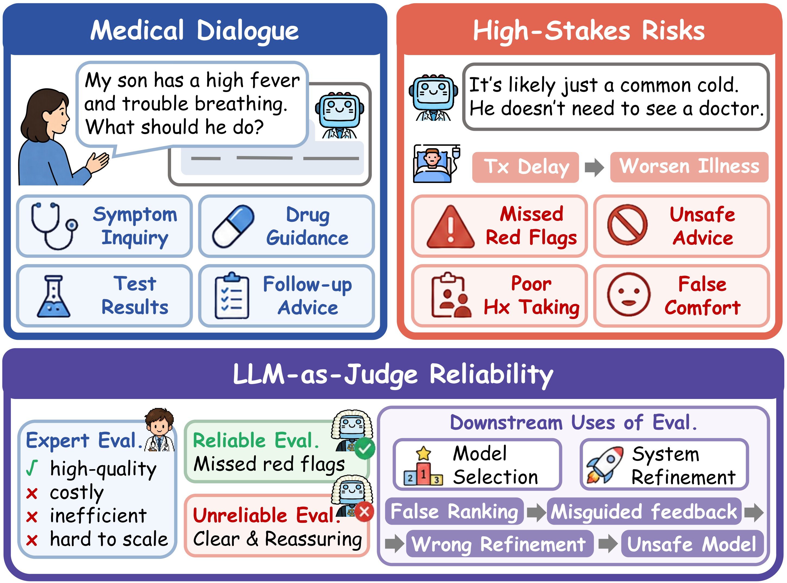
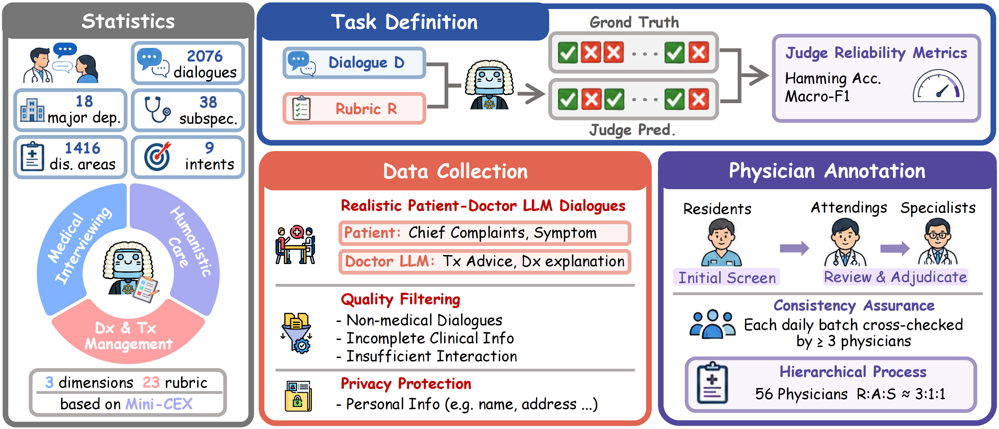
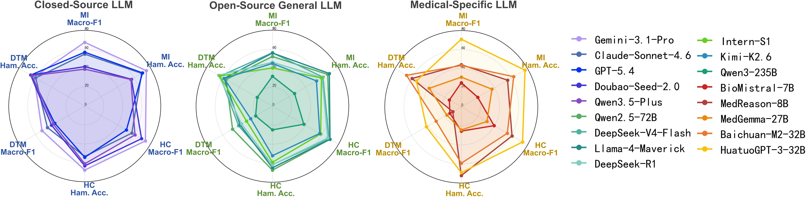

# Med-GRADE

**English** | [中文](README_ch.md)

**Med-GRADE** (*Medical Grading and Rubric-based Assessment of Doctor-Patient Encounters*) is a benchmark for evaluating how reliably large language models serve as **LLM-as-Judge** reviewers on medical dialogues. Unlike benchmarks focused on medical knowledge QA or general preference ranking, Med-GRADE asks whether models can assign stable, parseable binary scores on a **23-item Mini-CEX–adapted rubric** over real doctor–patient conversations, based on clinically observable behaviors.

<p align="center">
  
</p>

---

## Benchmark Overview

Med-GRADE contains **2,076** physician-reviewed real online doctor–patient dialogues, annotated by **56** physicians with a **23-dimensional rubric**, covering:

| Dimension | Abbr. | Items | What It Assesses |
|-----------|-------|-------|------------------|
| Medical Interviewing | MI | 1.1–1.8 | History taking, open-ended questions, plain language, rationale explanation, emergency recognition, etc. |
| Humanistic Care | HC | 2.1–2.8 | Respect and empathy, interview organization, emotional support, privacy protection, etc. |
| Diagnosis & Treatment Management | DTM | 3.1–3.7 | Information prioritization, credibility verification, differential diagnosis, treatment plan quality, etc. |

The dataset also includes clinical metadata: **18** primary departments, **38** secondary departments, **1,416** clinical domains, and **9** consultation intents. Dialogues average about **14.1** turns and **1,454** words.

<p align="center">
  
</p>

### Task Format

For each sample, the judge model receives:

1. **Doctor–patient dialogue** (`input`)
2. **23-dimensional scoring rubric** (see `prompt.py`)

The model outputs a JSON list of length **23**, where each element is `0` (not satisfied) or `1` (satisfied), in rubric order from 1.1 → 3.7.

### Evaluation Metrics

Consistent with the paper, `eval.py` computes:

- **Hamming Accuracy** — per-dimension agreement rate across all 23 items
- **Macro-F1** — macro-averaged F1 over the 23 items, mitigating class imbalance

Metrics are also aggregated by the three high-level dimensions (MI / HC / DTM).

<p align="center">
  
  <br>
  <sub><b>Performance across dimensions by model family</b></sub>
</p>

---

## Repository Structure

```
Med-GRADE/
├── qa.jsonl              # Evaluation input (dialogues + metadata, no gold labels)
├── ground_truth.jsonl    # Physician annotations (id + 23-dim output), required for eval
├── prompt.py             # 23-dim rubric instruction and output-format suffix
├── test.py               # Batch LLM-as-Judge evaluation
├── eval.py               # Compute metrics against ground truth
├── model_list.py         # API config for models to evaluate (create locally)
└── output/               # Run outputs
    ├── {model}.jsonl
    ├── {model}_token_stats.json
    ├── eval_summary.csv
    └── eval_summary.xlsx
```

### Data Format

**`qa.jsonl`** (input, one JSON object per line):

```json
{
  "id": 0,
  "input": "patient：...\n doctor：...",
  "department_level1": "Dermatology",
  "department_level2": null,
  "clinical_domain": "",
  "consultation_intent": "Treatment Recommendations"
}
```

**`ground_truth.jsonl`** (labels, one JSON object per line):

```json
{
  "id": 0,
  "output": [0, 1, 0, 1, 1, 0, 0, 1, 0, 1, 0, 0, 1, 1, 1, 1, 0, 0, 1, 0, 0, 0, 0]
}
```

`output` must be a length-23 list of `0/1` values, in the same order as `DEFAULT_INSTRUCTION` in `prompt.py`.

---

## Setup

```bash
pip install openai tqdm pandas openpyxl
```

Create `model_list.py` in the project root, for example:

```python
model_list = [
    {
        "save_name": "gemini-3.1-pro",
        "base_url": "https://your-api-endpoint/v1",
        "api_key": "YOUR_API_KEY",
        "model": "gemini-3.1-pro",
        "temperature": 0.7,
        "max_tokens": 1024,
    },
]
```

`test.py` uses `save_name` to name per-model output files. You can set model-specific options such as `disable_thinking` and `merge_system_to_user`.

---

## Usage

### 1. Run LLM judging — `test.py`

Call the judge model on each dialogue in `qa.jsonl` and write results to `output/{save_name}.jsonl`. Supports **checkpoint resume**.

```bash
# List available models
python test.py --list-models

# Run all models in model_list
python test.py

# Run selected models
python test.py -m gemini-3.1-pro gpt-5.4

# Custom input file
python test.py --input qa.jsonl -m your-model
```

**Output example** (`output/{save_name}.jsonl`):

```json
{
  "id": 0,
  "instruction": "...",
  "input": "patient：...",
  "output": [0, 1, 0, 1, 1, 0, 0, 1, 0, 1, 0, 0, 1, 1, 1, 1, 0, 0, 1, 0, 0, 0, 0],
  "input_tokens": 1234,
  "output_tokens": 56,
  "total_tokens": 1290
}
```

Failed parses retain a `parse_error` field; API failures retain an `error` field. Failed samples are automatically retried on resume.

### 2. Compute metrics — `eval.py`

Compare `output/*.jsonl` against `ground_truth.jsonl` to compute Macro-F1 and Hamming Accuracy.

```bash
# Evaluate all models under output/
python eval.py

# Specify ground truth and models
python eval.py --gt ground_truth.jsonl --output-dir output -m gemini-3.1-pro gpt-5.4

# Custom output paths
python eval.py -o output/eval_summary.csv --xlsx output/eval_summary.xlsx
```

**Output files:**

- `output/eval_summary.csv` — overall metrics per model
- `output/eval_summary.xlsx` — `Summary` and `By Category` (MI/HC/DTM breakdown) sheets

Unparseable predictions are treated as **all-wrong** in metric computation (each dimension counted as incorrect).

### 3. End-to-end example

```bash
# Step 1: Run judging
python test.py -m gemini-3.1-pro

# Step 2: Compute metrics
python eval.py -m gemini-3.1-pro
```

---

## Key Findings (Insights)

Based on experiments with 17 LLMs and 4 prompting strategies in the paper, Med-GRADE reveals:

1. **Overall reliability is only moderate.** The best model, Gemini-3.1-Pro, reaches **64.89%** Overall Macro-F1 and **68.28%** Hamming Accuracy — still far from safe deployment for clinical workflow QA.

2. **DTM is the hardest dimension.** Diagnosis and treatment management (differential diagnosis, plan quality, rationale explanation) lags significantly behind MI and HC. Medical-specialized models average only about **22.80%** Macro-F1 on DTM; the gap between Hamming and Macro-F1 is largest here, so item-level agreement may **overestimate** true reliability.

3. **Medical-specialized models are not automatically better.** Some medical models do reasonably on HC but lag on DTM items requiring clinical reasoning; consultation QA fine-tuning does not equal rubric-calibrated judging ability.

4. **More complex prompts are not always better.** Chain-of-Thought can break structured output (e.g., Gemini valid parse rate drops from 99.95% to 19.36%) or hurt Macro-F1; Few-shot / Self-refine help some items but shift scoring boundaries on others.

---

## Limitations

### Benchmark (paper)

- **Text-only dialogues** — no physical exam, labs, imaging, or other multimodal clinical data.
- **Specific language and healthcare context** (Chinese online consultations); cross-language and cross-institution generalization needs further study.
- **Rapid model and prompt evolution** — conclusions from 17 models may not transfer to future systems.

---
